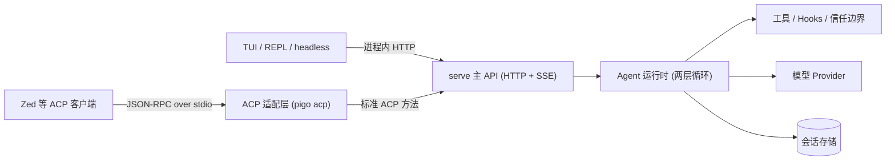

# pigo

[](https://github.com/smallnest/pigo/actions/workflows/ci.yml)
[](https://github.com/smallnest/pigo/actions/workflows/release.yml)

pigo 是一个用 Go 编写的 coding agent。它保持 pi 式简洁交互，能力通过技能、提示词模板和插件扩展；TUI、REPL 与 headless 脚本直接可用，同时通过标准 ACP（Agent Client Protocol）接入 Zed 等外部客户端。


## 特性一览

- **标准 ACP 接入**：`pigo acp` 以 JSON-RPC 2.0 over stdio 对外服务，Zed 等支持 ACP 的客户端可直接使用。
- **多运行形态**：TUI、行式 REPL、headless 一次性执行、HTTP serve 与 ACP 共用同一套运行时。
- **serve 主 API**：`pigo serve` 提供 HTTP + SSE 主 API，TUI/REPL/headless 与 ACP 适配层都建立在它之上。
- **技能与插件**：`~/.agents/skills` 下的技能统一暴露为 `/skill:<name>`，插件可提供额外工具和 slash 命令。
- **会话续跑与分支**：会话按项目持久化，支持 `--resume`、`/resume`、fork、clone 与分支树。
- **项目信任与工具边界**：`bash` / `write` / `edit` 等副作用工具受信任机制保护，支持 `--allowed-tools` / `--disallowed-tools`。
- **Hooks**：在工具调用、用户提交、会话生命周期等节点执行自定义命令，可拦截、注入或观察 Agent。
- **多 Provider**：内置 OpenRouter、Ollama、Anthropic、OpenAI 兼容端点及数十个云厂商，按 `<PROVIDER>_API_KEY` 约定取密钥。
- **上下文压缩**：接近窗口上限自动摘要，也可手动触发 `/compact`。
- **包管理与自更新**：`pigo install npm:<pkg>` 安装 pi 生态包，`pigo update` 更新二进制。

## 安装与构建

需要 Go 1.27+。

```bash
# 克隆并构建
git clone https://github.com/smallnest/pigo.git
cd pigo
go build ./cmd/pigo

# 或直接安装到 GOBIN
go install ./cmd/pigo
```

也可以从 [Releases](https://github.com/smallnest/pigo/releases) 下载预编译二进制（Linux / macOS / Windows，amd64 与 arm64），或用安装脚本：

```bash
curl -fsSL https://raw.githubusercontent.com/smallnest/pigo/master/install.sh | sh
```

安装脚本默认安装到 `/usr/local/bin`（无写权限时回退到 `~/.local/bin`），可用 `PIGO_VERSION` 指定版本、`PIGO_INSTALL_DIR` 指定目录。Windows 用户从 Releases 下载 `.zip` 解压即可。

也可以不构建，直接运行：

```bash
go run ./cmd/pigo -p "1+1=?"
```

构建后查看版本信息：

```bash
pigo --version
# pigo dev (commit none, built unknown)
```

自更新：无包名调用 `pigo update` 会把当前二进制升级到最新 Release；`pigo update <包名>` 则更新已安装的包。

## 快速开始

```bash
# 1. 配置默认 Provider（OpenRouter）的 API Key
export OPENROUTER_API_KEY=sk-or-...

# 2. 进入全屏 TUI
pigo

# 3. headless 跑一次 prompt，打印最终回答
pigo -p "读取 README 并用三句话总结"

# 4. 启动 HTTP 主 API（默认 127.0.0.1:4096）
pigo serve

# 5. 以 ACP 模式接入 Zed 等客户端
pigo acp
```

没有 `-p` 且 stdout 是终端时，`pigo` 进入 TUI；`--no-tui` 或非终端 stdout 使用行式 REPL。非终端且没有 prompt 时 pigo 会报错退出，方便在 CI 里避免误挂起。

使用本地 Ollama 模型：

```bash
pigo -m ollama/qwen2.5-coder -u http://localhost:11434/v1 -p "解释 main.go 做了什么"
```

headless 输出 JSON 事件流：

```bash
pigo -o stream-json -p "读取 README 并总结" > events.jsonl
```

## 命令行参数

常用参数见下表，完整参数与内置 Provider 清单请运行 `pigo --help`。

| 参数 | 说明 |
|------|------|
| `-p, --print <prompt>` | headless 一次性执行 |
| `-m, --model <id>` | 模型 id，默认 `openrouter/free` |
| `-u, --base-url <url>` | 覆盖 Provider base URL（如本地 Ollama） |
| `-k, --api-key <key>` | 指定 API Key，默认读 `<PROVIDER>_API_KEY` |
| `-P, --protocol <proto>` | 强制线路协议：`openai` \| `anthropic` |
| `--provider <name>` | 按名字选择内置 Provider |
| `-o, --output-format <fmt>` | `text` \| `stream-json` |
| `-n, --no-tools` | 禁用全部内置工具 |
| `--allowed-tools <list>` | 工具白名单，可重复、逗号分隔、大小写不敏感 |
| `--disallowed-tools <list>` | 工具黑名单，冲突时优先 |
| `-l, --list-sessions` | 列出已保存会话 |
| `-r, --resume <id>` | 续跑指定会话 |
| `-c, --continue` | 续跑最近一次会话 |
| `-a, --approve` | 信任当前目录，跳过逐次确认 |
| `--no-skills` | 禁用技能发现 |
| `--no-prompt-templates` | 禁用提示词模板发现 |
| `--prompt-template <path>` | 追加提示词模板，可重复 |
| `--system-prompt <text>` | 替换默认系统提示词 |
| `--append-system-prompt <text\|path>` | 追加系统提示词，可重复 |
| `--thinking-level <level>` | `off\|minimal\|low\|medium\|high\|xhigh\|max` |
| `--no-tui` | 强制行式 REPL |
| `-C, --cwd <dir>` | 切换工作目录（类似 `git -C`） |
| `-v, --version` | 打印版本信息 |

配置优先级：命令行 > `~/.config/pigo/config.toml` > 默认值。

使用示例：

```bash
# 位置参数等价于 -p
pigo "把 utils.go 里的 getUserName 重命名为 getUsername"

# 指定模型（claude-* 自动推断 Anthropic Provider）
pigo -m claude-3-5-sonnet-20241022 -p "审查 foo.go 的并发安全"

# 自定义系统提示词
pigo --system-prompt "你是一个只使用中文回答的 Go 专家" -p "什么是 goroutine 泄漏"

# 只允许读文件与搜索
pigo --allowed-tools read,grep -p "这个仓库的架构是什么"
```

## 模型与 Provider

默认模型 id 是 `openrouter/free`。解析顺序：显式 `--provider` / `--protocol` / `--base-url` 优先，其次 `ollama/` 前缀或本地 Ollama 端口，再按模型名推断（如 `claude-*` 走 Anthropic），最后回落到 OpenRouter。

常用 Provider：

| Provider | 线路 | 默认 base URL | API Key 环境变量 |
|----------|------|---------------|------------------|
| OpenRouter（默认） | OpenAI | `https://openrouter.ai/api/v1` | `OPENROUTER_API_KEY` |
| Ollama（本地） | OpenAI | `http://localhost:11434/v1` | 无需 |
| OpenAI 兼容端点 | OpenAI | 需 `--base-url` | `OPENAI_API_KEY` |
| Anthropic | Anthropic | `https://api.anthropic.com/v1` | `ANTHROPIC_API_KEY` / `CLAUDE_API_KEY` |

其余内置 Provider（deepseek、google、xai、mistral、minimax、moonshotai、zai、volcengine、dashscope、hunyuan 等）遵循 `<PROVIDER>_API_KEY` 约定，也支持 `<PROVIDER>_BASE_URL` 覆盖；完整清单与模型预设在 `pigo --help` 和 REPL 的 `/models` 中查看。

Key 解析顺序：`--api-key` > 环境变量（含 OAuth token）> 配置文件。base URL 覆盖顺序：`--base-url` > Provider 专有 `*_BASE_URL` > 通用 `<PROVIDER>_BASE_URL` > 注册表默认值。

## 交互式命令

以 `/` 开头的输入是 slash 命令。命令来源与优先级：内置命令 > 项目模板（`.pigo/prompts`）> 全局模板（`~/.pigo/{commands,prompts}`）> 插件命令 > 技能 > config/CLI 模板；同名时高优先级覆盖低优先级，被覆盖的命令会提示。

命令分三类：prompt 命令把参数展开成 prompt 交给 Agent；action 命令直接执行并返回状态行（如 `/model`）；hybrid 命令先执行副作用再注入 prompt（插件命令）。技能统一使用 `/skill:<name>` 前缀，TUI、REPL 与 ACP 中一致。

核心能力以内置命令形式提供（如 `/goal` 长任务、`/dream` 记忆整合、`/btw` 旁路提问、`/resume` 会话切换、`/compact` 上下文压缩），完整可用清单在 REPL/TUI 输入 `/help` 查看，外部客户端通过命令列表动态获取。

自定义提示词模板示例 `~/.pigo/prompts/review.md`：

```markdown
---
description: 审查代码变更
---
请审查最近的代码变更，重点检查并发安全与测试覆盖。$ARGUMENTS
```

模板正文支持 `$ARGUMENTS`、`$1`、`$@`、`${1:-default}`、`${@:N}` 等参数语法；同名模板按优先级覆盖，被覆盖的来源会打印提示。

## 会话与续跑

会话按项目持久化在 `$PIGO_HOME/projects/<workspace-slug>/sessions/`（默认 `~/.pigo/...`），包含 metadata、index 与 JSONL 转录。

```bash
pigo -l                 # 列出会话
pigo -r <session-id>    # 续跑指定会话
pigo -c                 # 续跑最近会话
```

交互式 `/resume` 会列出可续跑的会话：TUI/REPL 中执行 `/resume` 显示候选列表，`/resume <n>` 真正切换到对应会话并继续；外部 ACP 客户端（如 Zed）中 `/resume` 只返回候选文本，会话切换由客户端自己的对话列表完成。

会话还支持分支操作：`/fork [n]` 从历史消息分支成新会话，`/clone` 复制当前会话，`/tree [n]` 查看并切换分支，`/export` / `/import` 以 JSONL 导出和导入会话。

## 项目信任与工具边界

pigo 内置 `read` / `write` / `edit` / `bash` / `grep` / `find` / `todo` / `webfetch` / `websearch` / `task` 等工具（完整集随插件和配置变化）。`write`、`edit`、`bash` 属于副作用工具，在未信任目录中需要逐次确认。

- `--approve` / `-a` 信任当前目录并跳过逐次确认。
- `--allowed-tools` 是硬边界，白名单外的工具不会暴露给模型；`--disallowed-tools` 优先于白名单，冲突时移除。
- 信任记录持久化在 `$PIGO_HOME/trust.json`（默认 `~/.pigo/trust.json`）。
- 项目级 Hooks 与提示词模板只在目录受信任时加载，fail-closed。

### Hooks

Hooks 在 Agent 生命周期关键节点运行自定义命令，通过 stdin 接收单行 JSON，用退出码和 stdout JSON 控制 Agent。

| 事件 | 触发时机 | 可拦截 |
|------|---------|:---:|
| `PreToolUse` | 工具执行前 | 是 |
| `PostToolUse` | 工具执行后 | 反馈 |
| `UserPromptSubmit` | 用户提交 prompt 后 | 是 |
| `Stop` | 一轮结束 | 要求继续 |
| `SubagentStop` | 子 Agent 结束 | 要求继续 |
| `SessionStart` | 会话开始/恢复 | 注入 |
| `SessionEnd` | 会话结束 | 观察 |
| `PreCompact` | 上下文压缩前 | 观察 |
| `Notification` | Agent 通知 | 观察 |

全局配置 `~/.pigo/config.json`，项目配置 `.pigo/config.json`（仅受信任目录加载）：

```json
{
  "hooks": {
    "PreToolUse": [
      {
        "matcher": "bash",
        "hooks": [{ "type": "command", "command": "./.pigo/hooks/guard.sh" }]
      }
    ]
  }
}
```

安全须知：Hook 以当前用户身份执行，只配置可信命令；写入 stdin 的 JSON 只含可观察的非敏感字段，绝不包含 API Key；项目级 Hook 在未信任目录中一律忽略。

最小拦截脚本示例 `.pigo/hooks/guard.sh`（记得 `chmod +x`）：

```bash
#!/usr/bin/env bash
# 拦截包含 rm -rf 的 bash 命令
payload=$(cat)
cmd=$(printf '%s' "$payload" | jq -r '.tool_input.command // ""')
if printf '%s' "$cmd" | grep -Eq 'rm[[:space:]]+(-[a-zA-Z]*r[a-zA-Z]*[[:space:]]+)*-?[a-zA-Z]*f'; then
  echo "blocked: dangerous rm detected" >&2
  exit 2
fi
exit 0
```

## 技能、提示词模板与插件

### 技能

技能是带 YAML frontmatter（`name`、`description` 等）的 Markdown 文件，位于 `~/.agents/skills`（可用 `PIGO_SKILLS_DIR` 覆盖），支持平铺 `*.md` 与嵌套 `<name>/SKILL.md`。每个技能暴露为 `/skill:<name>` 命令，也会在系统提示词中登记，模型可在需要时用 `read` 工具加载正文。

### 提示词模板

Markdown 模板文件自动变成 slash 命令，正文支持 `$ARGUMENTS`、`$1`、`$@`、`${1:-default}` 等参数语法。来源与优先级：内置 > 项目 `.pigo/prompts` > 全局 `~/.pigo/{commands,prompts}` > config `prompts` > `--prompt-template`。系统提示词由基础指令、环境块、`AGENTS.md` 与 `--append-system-prompt` 分层组装。

### 插件

外部插件从 `$PIGO_HOME/plugins`（默认 `~/.pigo/plugins`）发现，可提供额外工具与 slash 命令；加载失败的插件会被记录并跳过，`--no-tools` 时整体跳过插件发现。

### 包管理

```bash
pigo install npm:pi-mcp-adapter       # 安装包
pigo list                             # 列出已安装包
pigo uninstall pi-mcp-adapter         # 卸载
pigo update pi-mcp-adapter            # 更新指定包
```

包类型包括 extension / skill / prompt / theme，安装记录写入 lockfile。

## 运行模式

| 模式 | 命令 | 说明 |
|------|------|------|
| TUI | `pigo` | 全屏交互界面，stdout 为终端时默认进入 |
| REPL | `pigo --no-tui` | 行式交互 |
| headless | `pigo -p "..."` | 一次性执行，`-o stream-json` 输出 JSON 事件 |
| serve | `pigo serve` | HTTP + SSE 主 API，默认 `http://127.0.0.1:4096` |
| acp | `pigo acp` | ACP 标准适配层，stdio JSON-RPC |

TUI、REPL 与 headless 默认通过进程内 serve-backed 运行时工作（`PIGO_HTTP_DEFAULT=0` 可退回旧路径）。`serve` 支持 `--hostname`、`--port`、`--password`、`--cors`，非回环地址必须设置密码；`acp` 内部映射到 serve API，不需要额外配置。

```bash
pigo serve                       # http://127.0.0.1:4096
pigo serve --port 8090           # 换端口
pigo serve --hostname 0.0.0.0 --password secret   # 局域网访问
```

## 外部客户端接入

### Zed

在 Zed settings 中配置 agent server：

```json
{
  "agent_servers": {
    "pigo": {
      "type": "custom",
      "command": "pigo",
      "args": ["acp"],
      "env": {}
    }
  }
}
```

保存后重新加载 Zed 配置，即可在 agent 列表中选择 pigo。

### HTTP / SSE

`pigo serve` 提供 REST 主 API：`/api/v1/session` 管理会话，`/api/v1/session/{id}/prompt` 提交 prompt，`/api/v1/session/{id}/prompt_async` 异步提交，`/api/v1/session/{id}/cancel` 取消，`/api/v1/events` 是 SSE 事件流（消息增量、工具状态、权限请求、命令更新等），另有 `/api/v1/commands`、`/api/v1/config`、`/api/v1/modes`、`/api/v1/permission/trust`。在线文档 `/api/v1/doc`，完整契约见 [api/v1/openapi.yaml](api/v1/openapi.yaml)。

```bash
# 创建会话
curl -X POST http://127.0.0.1:4096/api/v1/session \
  -H 'Content-Type: application/json' \
  -d '{"directory":"E:/project/pigo"}'

# 提交 prompt
curl -X POST http://127.0.0.1:4096/api/v1/session/<id>/prompt \
  -H 'Content-Type: application/json' \
  -d '{"directory":"E:/project/pigo","prompt":[{"type":"text","text":"hello"}]}'

# 订阅 SSE 事件
curl -N 'http://127.0.0.1:4096/api/v1/events?sessionId=<id>'
```

设置 `--password` 后，HTTP 请求需要 Basic Auth（用户名固定为 `pigo`，密码为 `--password` 的值）。

### ACP 方法面

`pigo acp` 只实现标准 Agent Client Protocol（协议版本 1，JSON-RPC 2.0 over stdio），不做非标准协议扩展。请求方法：

| 方法 | 说明 |
|------|------|
| `initialize` | 协议协商与能力声明 |
| `session/new` | 按 `cwd` 新建会话 |
| `session/load` | 加载已有会话并重放历史 |
| `session/list` | 列出会话 |
| `session/delete` | 删除会话 |
| `session/close` | 关闭会话 |
| `session/prompt` | 提交 prompt（异步返回，事件走通知） |
| `session/cancel` | 取消当前 prompt |
| `session/set_mode` | 切换模式 |
| `session/set_config_option` | 设置 `model` / `thought_level` / `mode` |
| `session/request_permission` | 权限确认 |

通知：`session/update`（消息增量、工具调用、模式/配置更新、可用命令更新、权限请求等）。标准定义见 [Agent Client Protocol](https://agentclientprotocol.com)。

ACP 客户端最小交互：

```json
{"jsonrpc":"2.0","id":1,"method":"initialize","params":{}}
{"jsonrpc":"2.0","id":2,"method":"session/new","params":{"cwd":"E:/project/pigo"}}
{"jsonrpc":"2.0","id":3,"method":"session/prompt","params":{"sessionId":"...","prompt":[{"type":"text","text":"hello"}]}}
```

## 架构总览

pigo 的运行时核心是两层循环：内层反复执行“流式回复 → 停止原因 → 工具调用 → 回填结果”，直到助手消息不再发起工具调用；外层消费后续消息并重跑内层，所有终止路径汇总到唯一出口。



所有前端共享同一条主 API：TUI/REPL/headless 在进程内走 serve，外部客户端走 HTTP/SSE 或 ACP 适配层，因此命令、工具、权限与事件行为保持一致。

## 目录与环境变量

| 路径 / 变量 | 用途 |
|-------------|------|
| `$PIGO_HOME` | 覆盖 `~/.pigo` 基础目录（sessions、plugins、trust 等） |
| `$PIGO_SKILLS_DIR` | 覆盖技能目录，默认 `~/.agents/skills` |
| `~/.config/pigo/config.toml` | 用户配置（`$XDG_CONFIG_HOME` 生效时在其下） |
| `~/.pigo/sessions.db` | 会话 canonical 存储（SQLite；v4 JSONL 仅用于导出/导入） |
| `~/.pigo/projects/<workspace>/sessions` | 旧版项目会话目录（升级前用隔离脚本归档） |
| `~/.pigo/plugins` | 外部插件 |
| `~/.pigo/prompts` / `~/.pigo/commands` | 全局提示词模板 |
| `.pigo/prompts` | 项目提示词模板（仅受信任目录） |
| `~/.pigo/trust.json` | 信任记录 |
| `~/.pigo/config.json` / `.pigo/config.json` | Hooks 配置 |
| `$PIGO_SERVER_HOSTNAME` / `$PIGO_SERVER_PORT` / `$PIGO_SERVER_PASSWORD` | serve 默认监听配置 |
| `$PIGO_THINKING_LEVEL` | 默认思考强度 |
| `$PIGO_ACP_ENABLE_EMBEDDED_CONTEXT` | ACP 启用 embedded context（`true`） |
| `$PIGO_HTTP_DEFAULT` | 设为 `0` 退回旧运行时路径 |
| `<PROVIDER>_API_KEY` | Provider 密钥 |
| `<PROVIDER>_BASE_URL` | Provider 端点覆盖 |

最小 `config.toml` 示例：

```toml
# ~/.config/pigo/config.toml
model = "openrouter/free"
allowed_tools = ["read", "grep", "bash"]
[memory]
enabled = true
```

## 安全说明

- pigo 会向解析出的 Provider 端点发起外部网络请求。
- `bash` / `write` / `edit` 会在本地产生副作用，由项目信任机制把关；`--approve` 只跳过确认，不扩大工具边界。
- Hooks 以当前用户身份执行，只配置可信命令；项目级 Hook 仅在目录受信任时生效。
- API Key 只从环境变量、配置或 `--api-key` 解析，不会出现在日志、事件或 ACP 载荷中。
- 处理来自文件、命令输出、网页等外部来源的内容时应视为不可信数据。

## 许可证

参见仓库根目录的 [LICENSE](LICENSE)。
